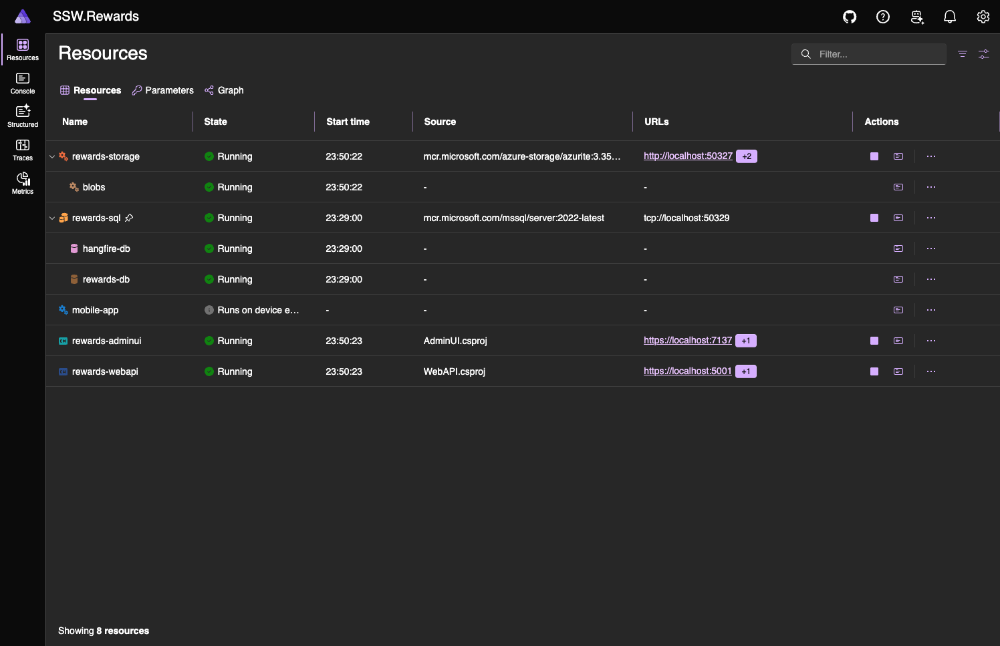
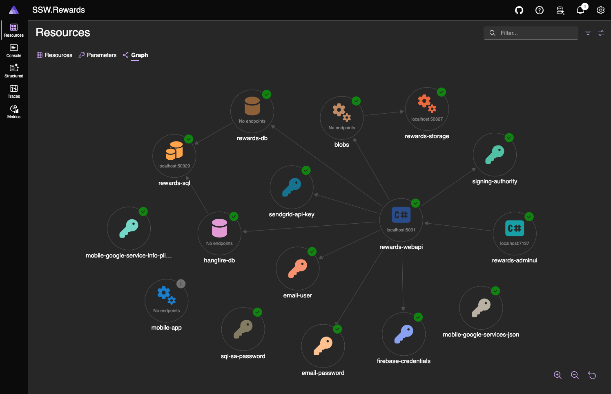
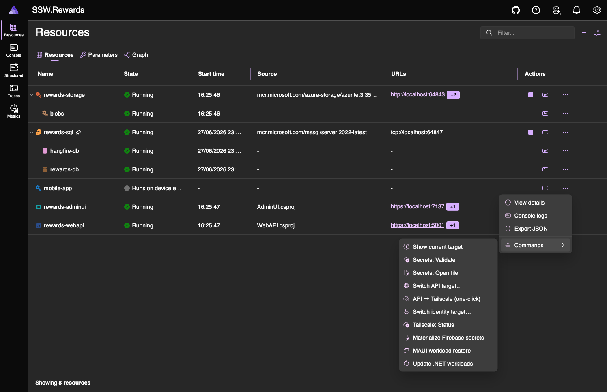
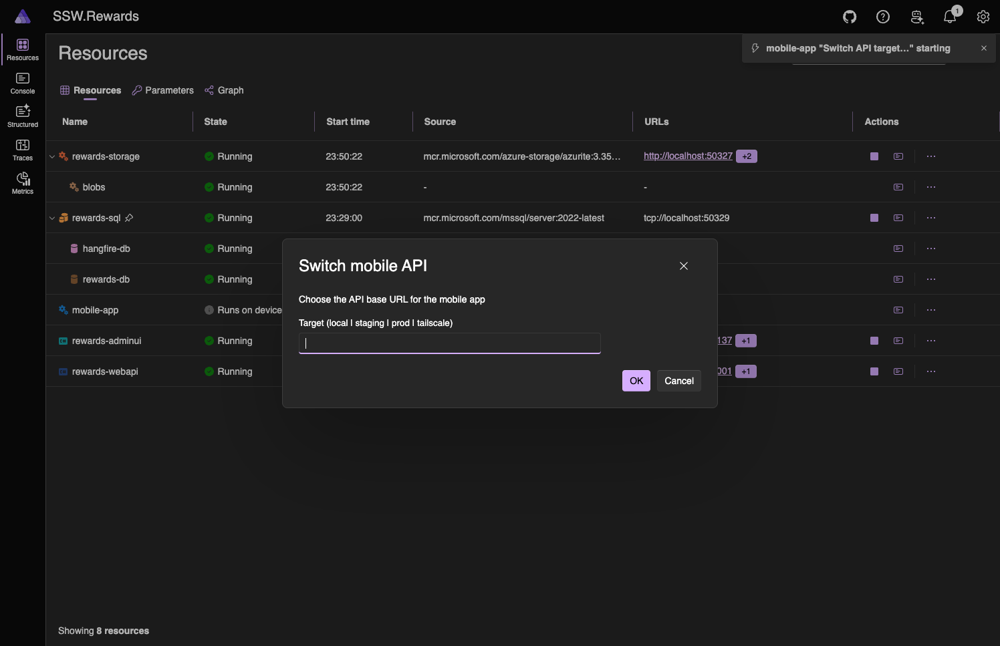
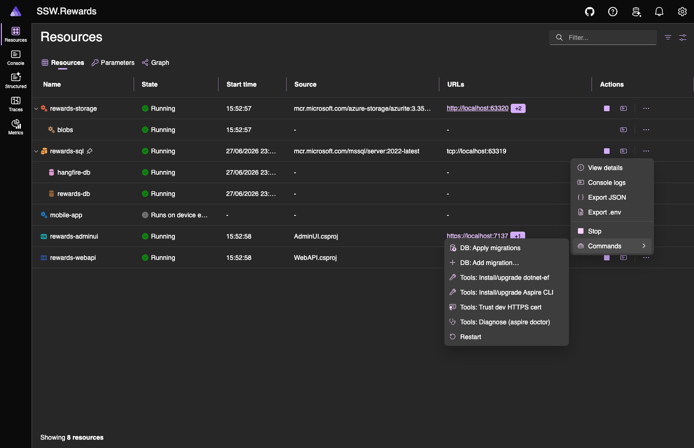
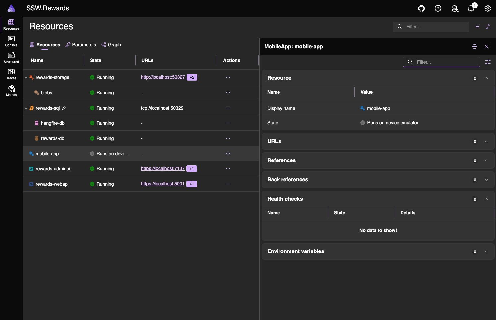

# SSW.Rewards — Local dev with .NET Aspire

This replaces `docker-compose.yml` + `up.ps1` + hand-edited secrets/URLs for local development.
The MAUI mobile app still runs the normal way (emulator/device) — Aspire's job for mobile is
config/secret **materialization** and tunnel wiring, not running the app.

## Prerequisites (one-time)
You need **three** things installed, plus **one** Keeper record. That's it.

| # | Install | Command | Who needs it |
|---|---|---|---|
| 1 | **.NET 10 SDK** | from <https://dot.net> — `global.json` pins `10.0.301` | everyone |
| 2 | **Aspire CLI** ≥ 13.4.6 | `dotnet tool install -g aspire` (update: `dotnet tool update -g aspire`) | everyone |
| 3 | **Docker** running | Docker Desktop / OrbStack | everyone |

> Steps 2 + 3 can also be done from the dashboard later: **rewards-sql ▸ Tools: Install/upgrade
> Aspire CLI** and **Tools: Diagnose (aspire doctor)** check your machine in one click.

### Optional dependencies (only for the people who need them)
Most backend devs **don't** need these — skip unless you're building the mobile app or doing
on-device testing.

- **MAUI workloads** — only to build/run the **mobile app**:
  ```bash
  dotnet workload install maui      # or `maui-android` for Android-only; needs sudo on a system-wide SDK
  ```
  Or use the dashboard: **mobile-app ▸ MAUI workload restore** / **Update .NET workloads**.
- **Tailscale** — only for **on-device** phone testing against your local API (stable URL + trusted
  HTTPS cert). Install from <https://tailscale.com/download>, then `tailscale up` on the Mac **and**
  the phone (same tailnet). See *Phone dev with Tailscale* below. Not needed for emulator + staging.

## Secrets — one record from Keeper, paste once
**Keeper is the only external resource you need.** Every stack secret (SQL password, Firebase,
SendGrid, SMTP, identity authority, mobile Firebase config) flows from **one** store the dev pastes
into: the AppHost user-secrets. No copying files around, no per-project pasting.

```bash
rewards-dev secrets edit     # opens the AppHost secrets.json in your editor
# → paste the whole "SSW.Rewards — Aspire Dev Secrets" record from Keeper ▸ SSW.Rewards, save
rewards-dev secrets check    # ✓/✗ for every required key — tells you exactly what's missing
```

`secrets check` lists each required key and, for anything missing/placeholder, **where in Keeper to
get it**. You can also drive both from the dashboard: **mobile-app ▸ Secrets: Open file** and
**Secrets: Validate**. Prefer a raw command? `rewards-dev secrets path` prints the file location
(macOS/Linux `~/.microsoft/usersecrets/<id>/secrets.json`, Windows
`%APPDATA%\Microsoft\UserSecrets\<id>\secrets.json`) — open it with `open`/`notepad` and paste.

> The Keeper record body is the literal `secrets.json` (flat `Parameters:*` keys). Aspire adds its
> own per-machine `AppHost:*` keys on first run — those are **not** in Keeper.

### Mobile secrets are isolated (no APK bleed)

The mobile app gets its **own** user-secrets store (`MobileUI.csproj` has a separate
`<UserSecretsId>`), so backend credentials can never leak into the mobile project / APK. You still
paste only the one Keeper record into the AppHost store; the mobile store is **derived**:

```bash
rewards-dev secrets sync-mobile   # copies ONLY the 2 Firebase client-config keys → mobile store,
                                  # then writes the git-ignored google-services.json + plist
```

This copies *only* `mobile-google-services-json` + `mobile-google-service-info-plist` — never the
SQL/SendGrid/email/Firebase-service-account secrets. The dashboard button **mobile-app ▸ Sync mobile
secrets (isolated)** runs the same thing.

## First run
```bash
rewards-dev secrets check   # make sure the Keeper blob is in place (see above)
aspire run                  # from the repo root — .aspire/settings.json points the CLI at src/AppHost
```
If a secret is missing, Aspire reports the parameter as *ValueMissing* and SQL won't start — run
`rewards-dev secrets edit`, paste, and re-run.

The dashboard opens automatically. SQL Server + Azurite come up as **persistent** containers
with data volumes (`ssw-rewards-sql-data`, `ssw-rewards-azurite-data`), so your data survives
restarts. WebAPI + AdminUI start once SQL is healthy; migrations apply on WebAPI startup.



> The **Graph** tab gives the same model as a topology view — handy to see how `rewards-webapi`
> wires up to SQL, Azurite, the secret parameters and the mobile config files:
>
> 

> Both containers are grouped under an **SSW.Rewards** project/folder in Docker Desktop & OrbStack
> (instead of cluttering the top level). Aspire stamps `com.docker.compose.project=SSW.Rewards` +
> `com.docker.compose.service=<name>` labels via `InDockerProject()` in `Hosts/DockerGrouping.cs`.

> Secrets now flow **only** from the AppHost — one store, see *Secrets* above. WebAPI/AdminUI no
> longer carry their own `UserSecretsId`. Aspire injects `ConnectionStrings:DefaultConnection` /
> `:HangfireConnection`, `CloudBlobProviderOptions:ContentStorageConnectionString` (→ Azurite),
> `Firebase:FirebaseCredentials`, `SendGridAPIKey`, `EmailUser`, `EmailPassword`, `SigningAuthority`
> as env vars.

## Dashboard commands
The dashboard groups the local-dev chores under two resources (Actions ▸ Commands):



Commands that need input (e.g. **Switch API target…**) open a prompt right in the dashboard. Target
pickers are **dropdowns** (local / staging / prod / tailscale) — no typos, valid by construction:



**On `rewards-sql` (database + tooling):**



- **DB: Apply migrations** / **Add migration…** — EF update / add (prompts for the name)
- **Tools: Install/upgrade dotnet-ef**, **Trust dev HTTPS cert**
- **Tools: Install/upgrade Aspire CLI** — `dotnet tool update aspire --global` (installs if missing)
- **Tools: Diagnose (aspire doctor)** — `aspire doctor` health check (CLI / SDK / Docker / dev-cert)

**On `mobile-app` (a virtual, lifetime-less resource for the MAUI app — Aspire doesn't run it,
but it gives the mobile chores a home):**



- **Secrets: Validate** / **Secrets: Open file** — `rewards-dev secrets check` / `edit`: confirm the
  one AppHost secrets store is complete, or open `secrets.json` to paste the Keeper record (see *Secrets* above)
- **Show current target** — `rewards-dev show` (prints the API + identity the apps point at)
- **Switch API target…** / **API → Tailscale (one-click)** / **Switch identity target…** — shell out
  to the `rewards-dev` CLI (below), which switches **all** apps, not just mobile
- **Tailscale: Status** — `tailscale status` (verify connectivity before using the tailscale target)
- **Sync mobile secrets (isolated)** — `rewards-dev secrets sync-mobile`: copies ONLY the two
  Firebase client-config keys into MobileUI's own isolated user-secrets store, then writes
  `google-services.json` + `GoogleService-Info.plist` (git-ignored; only `*.template` is committed).
  Backend secrets are never copied — nothing sensitive can reach the APK.
- **MAUI workload restore** — `dotnet workload restore` for the iOS/Android prereqs
- **Update .NET workloads** — `dotnet workload update` (keep MAUI/iOS/Android workloads current)

## Switching dev targets — the `rewards-dev` command
Stop hand-editing `Constants.cs` and the AdminUI `appsettings`. One command switches the
identity authority and/or API URL across **all apps**, in sync, via **git-ignored** overrides.
Run it from the repo root with the `./rewards-dev` wrapper (or add an alias —
`alias rewards-dev="$(git rev-parse --show-toplevel)/rewards-dev"` — to call it from anywhere).

| App | Override file (git-ignored) | Falls back to |
|---|---|---|
| Mobile | `src/MobileUI/Constants.LocalDev.cs` | committed `Constants.LocalDev.Default.cs` |
| AdminUI | `src/AdminUI/wwwroot/appsettings.Local.json` | committed `appsettings(.Development).json` |
| WebAPI | AppHost user-secret `Parameters:signing-authority` | prompted at `aspire run` |

```bash
# identity → Mobile + AdminUI + WebAPI ;  api → Mobile + AdminUI ;  env → both
./rewards-dev help                  # full self-teaching usage (targets, examples, files)
./rewards-dev secrets check         # validate the one AppHost secrets store (Keeper blob)
./rewards-dev env staging           # everything → staging (safe default)
./rewards-dev api local             # https://localhost:5001 (AdminUI + Mobile)
./rewards-dev api tailscale         # stable phone URL + auto `tailscale serve` (see below)
./rewards-dev identity local        # https://localhost:14330 (all apps)
./rewards-dev show --json           # current effective targets (machine-readable)
./rewards-dev reset                 # remove overrides → committed defaults
```
`api`/`identity` change only their own dimension and leave the other untouched. The same logic
runs head-less (AI / scripts) and from the Aspire dashboard commands. Rebuild the mobile app and
restart `aspire run` (AdminUI refresh + WebAPI) to pick up a change.

> `./rewards-dev` is a thin wrapper over `dotnet run --project tools/RewardsDev`. Code lives in
> `tools/RewardsDev/`: `Core/` (presets, repo paths, state, process helpers) and `Apps/` (one config
> writer per app — `MobileConfig`, `AdminUiConfig`, `WebApiConfig`).

## Build & run the mobile app
Aspire does **not** run the MAUI app — it runs on an emulator/device the usual way.
1. Install the MAUI workload once (above).
2. Pick a backend: `./rewards-dev env staging` (emulators can't reach
   `localhost`, so use `staging` or `api tailscale` — not `local` — when running on a device/emulator).
3. Ensure Firebase config exists (git-ignored): run `rewards-dev secrets sync-mobile` (or the
   **mobile-app ▸ Sync mobile secrets (isolated)** dashboard command). It isolates the two Firebase
   keys into the mobile store and writes `google-services.json` / `GoogleService-Info.plist`.
4. Build + deploy to a running emulator:
   ```bash
   dotnet build src/MobileUI/MobileUI.csproj -t:Run -f net10.0-android -c Debug -p:AdbTarget="-s <emulator-id>"
   ```
   (`-t:Run` pushes the Fast-Deployment assemblies; a plain `adb install` of the Debug APK won't run.)

## Phone dev with Tailscale (stable URL, real HTTPS cert)
Dev tunnels / ngrok give a new URL every session and an untrusted cert on iOS. Tailscale fixes both:
1. Install Tailscale on the Mac **and** the phone; sign both into the same tailnet (`tailscale up`).
2. Point the mobile app at the stable hostname (this also starts the HTTPS proxy for you):
   ```bash
   ./rewards-dev api tailscale
   ```
   It auto-detects your MagicDNS name (e.g. `https://<machine>.<tailnet>.ts.net:5001`) **and** runs
   `tailscale serve --bg --https 5001 https+insecure://localhost:5001` so the phone gets a real
   Let's Encrypt cert for your `*.ts.net` name — iOS trusts it, no dev-cert sideloading.
   > First-time setup can be slow (cert issuance), and your tailnet must have **HTTPS enabled** in the
   > admin console (Settings → Keys / HTTPS Certificates). If auto-serve can't start, `rewards-dev`
   > still switches the URL and prints the manual command to run once:
   > `tailscale serve --bg --https 5001 https+insecure://localhost:5001`.
No more per-session URL churn in `Constants.cs`.

## Notes / gotchas
- `aspire run` must run with the **Development** environment so user-secrets load (otherwise secret
  parameters report *ValueMissing* and SQL never starts). The committed
  `src/AppHost/Properties/launchSettings.json` sets this; if you launch differently, export
  `DOTNET_ENVIRONMENT=Development`.
- `Aspire.AppHost.Sdk` is pinned to **13.4.6** — older versions are rejected by the DCP runtime.
- `IInteractionService` (the command-time masked prompts) is experimental → `ASPIREINTERACTION001`
  is suppressed in the AppHost csproj.
- `docker-compose.yml` / `up.ps1` can be retired for local dev (kept for now if any pure-container
  CI path still relies on them).
