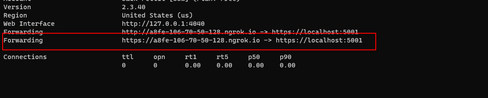

## Getting Started

**TODO** VS for Mac is EOL - Look into VS Code development method (C# + Maui Extensions)
**TODO** Find Azurite seed data for the API (Tylah might be blind)
**TODO** Update iOS instructions

### Required Tools

- Ensure you have .NET 8 installed https://dotnet.microsoft.com/en-us/download/dotnet/8.0

- Visual Studio 2022
- Android SDK setup/ installed w/ Xamarin (https://docs.microsoft.com/en-us/xamarin/android/get-started/installation/android-sdk)
- iOS SDK setup/installed w/ Xamarin (https://docs.microsoft.com/en-us/xamarin/ios/get-started/installation/)
- [Azurite - Previously Azure Storage Emulator](https://learn.microsoft.com/en-us/azure/storage/common/storage-use-azurite?tabs=visual-studio,blob-storage) (Automatically part of Visual Studio 2022)
- [Azure Storage Explorer](https://azure.microsoft.com/en-us/features/storage-explorer/) (Easy way to upload and download files (see Local Emulator Database)
- [ngrok](https://ngrok.com/) (Api and Mobile communication)
****

### Required Tools (for Mac)

- XCode v15.0.1+
  - Check or set `Command Line Tools` location
  - **Preferences** | **Locations** | **Command Line Tools**
- Visual Studio for Mac 2022 (EOL - April 2024)
  - Enable .NET 8 SDK in **Preferences** | **Other** | **Preview Features**
- [Azurite](https://learn.microsoft.com/en-us/azure/storage/common/storage-use-azurite?tabs=visual-studio,blob-storage) (For Docker or Visual Studio Code)

## The F5 Experience

### Web API

1. Clone the repository 
   1. `git clone https://github.com/SSWConsulting/SSW.Rewards.API.git`
3. Grab connection strings from an existing dev to create local `secrets.json` file (https://docs.microsoft.com/en-us/aspnet/core/security/app-secrets?view=aspnetcore-3.0&tabs=windows)
4. Install / Run `Azure Storage Emulator` (Run the .exe or use the "start" command)
5. Install / Run [Azure Storage Explorer](https://azure.microsoft.com/en-us/features/storage-explorer/#overview)
6. Start Explorer (**On First Install** - See steps below)
   1. Sign in using the "Subscription" option
   2. Select the "Azure" option
   3. Next (Sign in with your account that has access to ssw1 DevOps)
7. Inside the Explorer - **Local & Attached** | **Storage Accounts** | **Emulator** | **Blob Containers**
8. Create a **new container** called `profile`
9.  Copy over all files in `SeedData/profiles` (images + .xlsx) into the newly created `profile` container
10. Press f5
11. Test that you can access the swagger docs @ `https://localhost:5001/swagger/`
12. **(Optional)** - If you need to run the api and mobile app locally. Set up an [ngrok](https://ngrok.com/) account (This is free and signing up allows 24hour access instead of the 2hours without an account)
   1. Once you have an account / installed ngrok
      Run `ngrok http https://localhost:5001`

### Mobile App Android

1. Get the source code 
   1. `git clone https://github.com/SSWConsulting/SSW.Rewards.Mobile.git`
2. Connect Android Device or Emulator (https://docs.microsoft.com/en-us/xamarin/android/get-started/installation/android-emulator/)
3. Set build target as desired device.
4. **(Optional)** - Using ngrok - If you need to connect to the Api locally
   1. Under SSW.Rewards | **Constants.cs**
   2. Update the `Constants.cs` `ApiBaseUrl` in The **#if DEBUG** region to use the custom ngrok **https** address (See Image below)
      
      **Figure: ngrok https address**
5. Run / press f5

### Mobile App iOS (Mac Only)
1. Get the source code
   1.  `git clone https://github.com/SSWConsulting/SSW.Rewards.Mobile.git`
2. Set build target (either connected iOS device or emulator)
3. Run / Press F5

**NOTE: if you cannot build and see an error relating to the provisioning profile/ app signing identity**

1. Open up the iOS project settings by right clicking on SSW.Consulting.iOS and selecting Options.
1. go to 'iOS Bundle Signing' and select your signing identity and provisioning profile.

- these should be automatic by default but if you get an error you can manually set them.
- if you don't have these, talk to another Team Member or Sys Admin and get them to add your appleID to the Superior Software for Windows Pty Ltd
  Apple Developer Program Team)

[Now you are setup, lets get started on a PBI](Definition-of-Ready.md)

Be sure to read the [Definition of done](Definition-of-Done.md) and the [Definition of ready](Definition-of-Ready.md)