# The F5 Experience

**NOTE:** ⚠️ From 07/07/2025 we moved from Azure SQL Edge to SQL Server 2022! If you have setup SSW.Rewards before that date, backup your DB and restore it after running Docker compose.

## Local architecture

```mermaid
%%──────────────────────────────────────────────────────────
%%  SSW-red on charcoal  – same layout as your first diagram
%%──────────────────────────────────────────────────────────
%%{ init: {
      "theme":"base",
      "darkMode":true,                  /* custom colours win   */
      "themeVariables":{
        "fontSize":"15px",
        "fontFamily":"Inter, Segoe UI, sans-serif",

        /* red accents */
        "lineColor":"#d50000",
        "arrowheadColor":"#d50000",
        "clusterBorder":"#d50000",

        /* link label colour (edge text) */
        "tertiaryTextColor":"#cccccc"
      },
      "themeCSS":".node rect, .node polygon, .cluster rect { filter:none !important; }",
      "flowchart":{ "curve":"basis" }
}%%

flowchart LR

%%──────────────────── Local ────────────────────
subgraph Local["🧑‍💻 Local"]
  direction TB
  MobileApp["📱 Mobile App<br/>(Xamarin / .NET&nbsp;MAUI)"]
  DevTunnel[/"🌐 Dev Tunnel<br/>(ngrok / Dev Tunnels)"/]
  AdminUI["🖥️ Admin UI<br/>(Blazor)"]
  WebAPI{{"⚡ WebAPI<br/>(ASP.NET Core)"}}

  MobileApp -- HTTPS --> DevTunnel
  DevTunnel -- HTTPS --> WebAPI
  AdminUI  -- HTTPS --> WebAPI
end

%%──────────────────── Docker ───────────────────
subgraph Docker["🐳 Docker"]
  direction TB
  SQLServer[("🗄️ SQL Server")]
  Azurite[("🪣 Azurite Blob Storage")]

  WebAPI -- SQL --> SQLServer
  WebAPI -- "Blob API" --> Azurite
end

%%────────────────── External ───────────────────
subgraph External["🌐 External"]
  direction TB
  SSWIdentity["🔐 SSW.Identity<br/>(can run local)"]
  SSWQuizGPT["🧠 SSW.QuizGPT<br/>(can run local)"]
  NotificationHub["🔔 AWS Notification Hub"]

  WebAPI    -- HTTPS         --> SSWQuizGPT
  WebAPI    -- HTTPS         --> SSWIdentity
  AdminUI   -- HTTPS         --> SSWIdentity
  MobileApp -- HTTPS         --> WebAPI
  MobileApp -- HTTPS         --> SSWIdentity

  WebAPI    -- Notifications --> NotificationHub
  NotificationHub -- Push    --> MobileApp
end

%%────────────────── Styling ────────────────────
classDef clusterStyle stroke-width:2,rx:6,ry:6;
classDef service fill:#1e1e1e,stroke:#d50000,stroke-width:1,color:#ffffff;

class Local,Docker,External clusterStyle;
class MobileApp,DevTunnel,AdminUI,WebAPI,SQLServer,Azurite,SSWIdentity,SSWQuizGPT,NotificationHub service;
```



## Requirements 
**TODO** Find Azurite seed data for the API (Tylah might be blind)

- .NET 9 SDK https://dotnet.microsoft.com/en-us/download/dotnet/9.0
- IDE - Visual Studio Enterprise Latest // Jetbrains Rider // VS Code 
- Android SDK setup/ installed w/ Xamarin (https://docs.microsoft.com/en-us/xamarin/android/get-started/installation/android-sdk)
- iOS SDK setup/installed w/ Xamarin (https://docs.microsoft.com/en-us/xamarin/ios/get-started/installation/)
- [PowerShell Core](https://github.com/PowerShell/PowerShell)
- [Docker Desktop](https://docs.docker.com/desktop/)
- Optional: [Azure Data Studio](https://azure.microsoft.com/en-us/products/data-studio/) (Not required, can use IDE Tools for DB Querying)
- Optional: [Azure Storage Explorer](https://azure.microsoft.com/en-us/features/storage-explorer/) (Easy way to upload and download files)

- Install Dev Tunnels or Ngrok see the rule https://ssw.com.au/rules/port-forwarding/
  - [dev tunnels](https://learn.microsoft.com/en-us/azure/developer/dev-tunnels/get-started?tabs=macos) (Recommended)
  - [ngrok](https://ngrok.com/)

### Required Tools (for Mac)

- XCode v15.0.1+
  - Check or set `Command Line Tools` location
  - **Preferences** | **Locations** | **Command Line Tools**

## Setting up the Repo for Development
### To work on the API + Admin UI
1. Clone this Repo https://github.com/SSWConsulting/SSW.Rewards.Mobile.git
2. Download and install latest .NET 9 SDK
3. Get the Secrets from Keeper 
   1. **Client Secrets | SSW | SSW.Rewards | Developer Secrets**
   2. Add them as .NET User Secrets for `WebAPI.csproj`
4. Create a Developer Certificate with command below
   1. Make sure you have folder `.aspnet\https` in your home directory
   1. Run the script below (You can change change this, but the `docker-compose.yml` should be updated appropriately)

**Windows Terminal**
```bash
dotnet dev-certs https -ep $env:USERPROFILE\.aspnet\https\WebAPI.pfx -p ThisPassword
dotnet dev-certs https --trust
```

**Mac**
```bash
dotnet dev-certs https -ep ${HOME}/.aspnet/https/WebAPI.pfx -p ThisPassword
dotnet dev-certs https --trust
```

**NOTE:** If when creating WebAPI.pfx you get "A valid HTTPS certificate is already present." use `dotnet dev-certs https --clean` to remove the existing certificate.
**NOTE:** See https://learn.microsoft.com/en-us/aspnet/core/security/docker-https?view=aspnetcore-8.0#certificates if there are any issues.

5. Cd into the Repo
6. Run the Docker Containers
* On Windows, open PowerShell and run:
 ```bash
 ./up.ps1
 ```
* On macOS or Linux, open a terminal and run:
```bash
pwsh ./up.ps1
```
  
You should now be able to access the AdminUI hosted locally at https://localhost:7137  
  
You should now be able to access the WebAPI Swagger docs at https://localhost:5001/swagger/index.html

**NOTE:** For active development for WebAPI and AdminUI, we can just start up dependencies for them:
```bash
docker compose --profile tools up -d
```

**Note:** You can run only the WebAPI or AdminUI by running:
```bash
docker compose --profile webapi up -d
```
OR
```bash
docker compose --profile admin up -d
```

7. Check `Managing-DB.md` if you want to restore existing DB.

**TODO: Current seeding might not fully work for development. [Tech-Debt - #540](https://github.com/SSWConsulting/SSW.Rewards.Mobile/issues/540)**

Currently, we need to restore the DB like for instance from staging or another developer. Follow `Managing-DB.md` for backup and restore instructions.

## Mobile UI

Follow Microsoft Learn’s step-by-step guide to get your first .NET MAUI project up and running. It lets you run Mobile UI without issues. https://learn.microsoft.com/en-us/dotnet/maui/get-started/first-app?view=net-maui-8.0&tabs=vsmac&pivots=devices-android 

### To work on the Mobile UI (Android SDK)
1. Run the Docker containers (Only WebApi required)
2. Start a Dev Tunnel for the API
```bash
devtunnel host -p 5001
```
3. Update the `Constants.cs` `ApiBaseUrl` in the **#if DEBUG** block to use your DevTunnel address
4. Run the MobileUI, targeting your Android Emulator

### To work on the Mobile UI (iOS, MacOS Only)
1. Complete steps 1-3 above
2. Run the MobileUI, targeting your Android Emulator

**NOTE: if you cannot build and see an error relating to the provisioning profile/ app signing identity**

**NOTE: if the solution fails to load, open a terminal in the SSW.Rewards.Mobile folder and run:**

```bash
dotnet workload update
dotnet workload restore
```

1. Open up the iOS project settings by right clicking on SSW.Consulting.iOS and selecting Options.
1. go to 'iOS Bundle Signing' and select your signing identity and provisioning profile.

- These should be automatic by default but if you get an error you can manually set them.
- If you don't have these, talk to another Team Member or Sys Admin and get them to add your AppleID to the Superior Software for Windows Pty Ltd
  Apple Developer Program Team

### Setting up your own iPhone for testing
If you want to set up to deploy to your own iPhone, talk to an App Manager, it's hard! :)
Or you can give it a go yourself. For that you will be using 2 portals - App Store Connect and Apple Developer Portal:
1. Talk to a team member who has either Admin or App Manager role in App Store Connect. Give them your Apple ID (you can provide your personal one) and they will send you an invite to the Apple Developer team. If you've never used Apple products before, you will need to [create an Apple ID](https://support.apple.com/en-au/108647). You need to be granted **at least the App Manager role** to be able to perform some of the steps below; otherwise ask someone with the App Manager Role or higher to assist you.
2. On your mac create a Certificate Signing Request (CSR) using Keychain. Go to Keychain Access -> Certificate Assistant -> Request a certificate from a certificate authority. Fill the fields and save generated CSR somewhere.
3. Go to https://developer.apple.com, scroll down and click "Certificates, IDs, & Profiles".
4. Select the Certificates tab. Add a new Certificate of type `Apple Development`. For that you will need to upload the CSR. Once the certificate is created, the CSR is no longer needed and can be deleted.
5. Download the certificate on your mac and double click it to install.
6. Go back to the developer portal and select the Devices tab.
7. Add a device you are gonna be using for testing. To get your device's UDID connect it to your mac and open the Music app. Select your device on the left and then click a couple of times on the subtitle which displays your iPhone model, storage and battery level.
8. Once your device is added to the developer portal, select the Profiles tab. Update the provisioning profile for iOS App Development `SSWRewards_Dev`. Select the certificate and device added on the previous steps. **Tip:** Any changes to the provisioning profile won't disrupt the work of your team.
9. Download the provisioning profile on your mac and double click to install it. **Tip:** provisioning profiles are installed to _~/Library/MobileDevice/Provisioning Profiles/_

After that you should be able to deploy and debug the application on your iPhone.

### Creating a production build locally
Currently we have GitHub Actions which build and push the application to InternalTesting and TestFlight. But sometimes it's required to build and sign the application locally.
Below is a detailed description how to do that.

#### iOS
Apple expects developers to have individual development certificates (up to 2 per developer) and share distribution certificates (up to 3 per team).
To be able to build and sign an ipa file you need to have a distribution certificate and provisioning profile associated with it installed on your machine.
All the secrets can be found in our password manager (PM).

1. Get distribution certificate as a base-64 string from PM and run: `echo <cert-base64-string> | base64 --decode > DistributionCertificate.p12`
2. Double click the certificate to install it; use the password from PM
3. Download distribution provisioning profile form the Apple Developer Portal
4. Double click the provisioning profile to install it
5. Go to the MobileUI folder
6. Run `dotnet publish -f net9.0-ios -p:ArchiveOnBuild=true -p:CodesignKey="XXX" -p:CodesignProvision="YYY"`; XXX is the CertificateName (in PM) and YYY is ProfileName (same as in Apple Developer Portal)
7. The ipa file in the _../MobileUI/bin/Release/net9.0-ios/ios-arm64/publish/_ folder is ready to be uploaded to TestFlight

#### Android
1. Find keystore info in PM
2. Run `echo <keystore-base64-string> | base64 --decode > rewards.keystore`
3. To see the info about keystore run `keytool -list -v -keystore rewards.keystore`
4. Run `dotnet publish -f net9.0-android -p:AndroidKeyStore=true -p:AndroidSigningKeyStore=rewards.keystore -p:AndroidSigningKeyAlias=XXX -p:AndroidSigningKeyPass=YYY -p:AndroidSigningStorePass=YYY`; XXX and YYY can be found in PM
5. The signed aab file in the _../MobileUI/bin/Release/net9.0-android/publish/_ folder is ready to be uploaded to InternalTesting


[Now you are setup, lets get started on a PBI](Definition-of-Ready.md)

Be sure to read the [Definition of done](Definition-of-Done.md) and the [Definition of ready](Definition-of-Ready.md)
