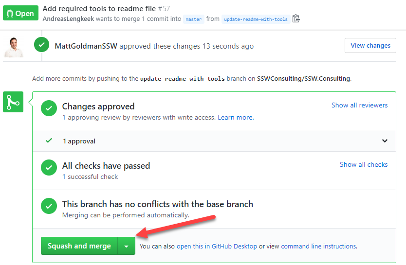
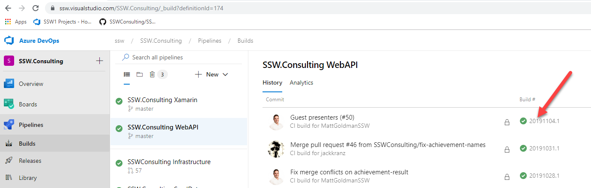

# Deployment

### Web API / Infrastructure

1. Merge PR into master
   
   **Figure: Merge Pull Request after getting approval**

2. Build pipeline will automatically run and deploy the changes into the DEV environment
   
   **Figure: Wait for a successful build**

3. Perform sanity checks (described below)

4. Get approval on the Production release to deploy to Production

### Sanity checks
The following checks must be performed on the staging environment and signed off by another developer before deploying to staging.

* Can sign into the mobile app
* Can complete an achievement in the mobile app
* Can purchase a reward in the mobile app
* Can sign in to the Admin portal

### Mobile App

1. Merge PR into master
1. Build pipelines for both Android and iOS will run and push the changes to App Center testers
1. Get approval on the Production release to deploy to Play Store and Production
