# Deployment

### Web API / Infrastructure

1. Merge PR into main
   
   **Figure: Merge Pull Request after getting approval**

2. Build pipeline will automatically run and deploy the changes into the DEV environment
   
   **Figure: Wait for a successful build**

3. Perform sanity checks (described below)

4. Get approval on the Production release to deploy to Production

### Sanity checks

The following checks must be performed on the staging environment and signed off by another developer before deploying to staging.

- Can sign into the mobile app
- Can complete an achievement in the mobile app
- Can purchase a reward in the mobile app
- Can sign in to the Admin portal

### Admin Portal CDN Cache Management

The Admin Portal is deployed to Azure Storage Static Website and served through Azure Front Door for both staging and production environments.

#### Important Configuration Notes

- **Azure Front Door Resource Location**: Both staging and production Front Door profiles are located in the **Production resource group** (cost optimization)
- **Automated Purge**: GitHub Actions automatically purges the Front Door cache after each deployment
- **Manual Purge Access**: When requesting Azure staging resources access via My Access from SysAdmin, CDN purge permissions are now included

#### Manual Cache Purge (if needed)

If you need to manually purge the cache outside of deployment:

1. Navigate to [Azure Portal - Production Resource Group](https://portal.azure.com/#@sswcom.onmicrosoft.com/resource/subscriptions/b8b18dcf-d83b-47e2-9886-00c2e983629e/resourceGroups/SSW.Consulting.Prod/overview)
2. Find the Front Door profile for the environment you need to purge
3. Select **Endpoints** → Choose the endpoint
4. Click **Purge** and enter `/*` to purge all cached content

Alternatively, use Azure CLI:

```bash
# Purge staging Front Door cache
az afd endpoint purge \
  --resource-group SSW.Consulting.Prod \
  --profile-name <staging-profile-name> \
  --endpoint-name <staging-endpoint-name> \
  --content-paths '/*' \
  --domains <staging-domain>

# Purge production Front Door cache
az afd endpoint purge \
  --resource-group SSW.Consulting.Prod \
  --profile-name <prod-profile-name> \
  --endpoint-name <prod-endpoint-name> \
  --content-paths '/*' \
  --domains <prod-domain>
```

> **Note**: Cache purge typically takes 2-5 minutes to propagate globally.

### Mobile App

1. Merge PR into main (this triggers the mobile CI/CD pipeline).
2. Pipeline builds Android & iOS artifacts. After the beta approval gate is granted it automatically uploads:
   - Android build to the configured Google Play beta/internal track.
   - iOS build to TestFlight.
3. Testers on those tracks receive the update automatically (no manual upload required).
4. After beta validation passes, a separate Production approval gate promotes the build to the public stores.
5. For tester management and promotion specifics see [Beta Testing Guide](Instructions-Beta-Testing.md)

# High-level production dependencies

```mermaid
%%{ init: {
      "theme":"base",
      "darkMode":true,
      "themeVariables":{
        "fontSize":"15px",
        "fontFamily":"Inter, Segoe UI, sans-serif",

        /* red accents */
        "lineColor":"#d50000",
        "arrowheadColor":"#d50000",
        "clusterBorder":"#d50000",

        /* link label colour (edge text) */
        "tertiaryTextColor":"#cccccc"
      },
      "themeCSS":".node rect, .node polygon, .cluster rect{filter:none!important}",
      "flowchart":{"curve":"basis"}
} }%%

flowchart LR

%%────────────── Azure workloads ──────────────
subgraph Azure["☁️ Azure (Production)"]
  direction TB
  subgraph "Apps"
    direction LR
    AdminUI["🖥️ Admin UI<br/>(Blazor)"]
    MobileApp["📱 Mobile App<br/>(Xamarin / .NET&nbsp;MAUI)"]
  end
  WebAPI{{"⚡ WebAPI<br/>(ASP.NET Core)"}}
  subgraph "Storage"
    SQLServer[(🗄️ SQL Server)]
    Azurite[(🪣 Azurite Blob Storage)]
  end

  AdminUI   -- HTTPS --> WebAPI
  MobileApp -- HTTPS --> WebAPI

  WebAPI -- SQL        --> SQLServer
  WebAPI -- "Blob API" --> Azurite
end

%%──────────── External (flat / horizontal) ───────────
subgraph External["🌐 External Services"]
  direction LR         %% <── single horizontal line
  SSWIdentity["🔐 SSW.Identity"]
  SSWQuizGPT["🧠 SSW.QuizGPT"]
  NotificationHub["🔔 AWS Notification Hub"]

  %% inbound flows – all arrows point right
  WebAPI    -- HTTPS --> SSWIdentity
  WebAPI    -- HTTPS --> SSWQuizGPT
  AdminUI   -- HTTPS --> SSWIdentity
  MobileApp -- HTTPS --> SSWIdentity
  WebAPI -- Push  --> NotificationHub
  NotificationHub -- Push  --> MobileApp
end

%%────────────── Styling helpers ──────────────
classDef clusterStyle stroke-width:2,rx:6,ry:6;
classDef service      fill:#1e1e1e,stroke:#d50000,stroke-width:1,color:#fff;

class Azure,External clusterStyle;
class AdminUI,MobileApp,WebAPI,SQLServer,Azurite,SSWIdentity,SSWQuizGPT,NotificationHub service;
```


