# Deployment

### Web API / Infrastructure

1. Merge PR into main

  

    
     
    <em>Figure: Merge Pull Request after getting approval</em>
  

2. Deploy to Staging via GitHub Actions (manual)

   

     
      
     <em>Figure: Click "Run workflow" and select branch <code>main</code> to trigger the deployment</em>
   

- Workflow: "API - Main (Build & deploy)" (`.github/workflows/api-main.yml`)
- Approval: After code is built, you'll need to approve deployment to staging and later to production
- Note: Sometimes when running Web API and Admin Portal deployment, one of them might fail because Azure is busy due to infra deployment. Just re-run deployment.

   

     
      
     <em>Figure: After successful build and staging deploy, the workflow waits for approval to deploy to production</em>
   

   

     
      
     <em>Figure: Click "Approve and deploy" to promote to the production environment</em>
   

3. Perform sanity checks on Staging (see checklist below)

4. Promote to Production

- Approve the Production gate in the same workflow run (manual approval required)

### Sanity checks

The following checks must be performed on the staging environment and signed off by another developer before deploying to staging.

- Can sign into the mobile app
- Can complete an achievement in the mobile app
- Can purchase a reward in the mobile app
- Can sign in to the Admin portal

### Admin Portal

1. Merge PR into main
2. Deploy to Staging via GitHub Actions (manual)

- Workflow: "Admin - Main (Build & Deploy)"
- YAML: `.github/workflows/admin-main.yml`
- Trigger: Manual from the Actions tab → Run workflow → branch `main` → environment `Staging`
- Note: This workflow deploys the Admin application and related infrastructure (e.g., Storage Static Website, Azure Front Door configuration). Running this at the same time as the API deployment to the same environment might cause one to fail. If that happens, just re-run the failed deployment.

3. Perform sanity checks (Admin login, navigation, notifications UI where relevant)
4. Promote to Production (manual approval required in the workflow)

### Admin Portal CDN Cache Management

The Admin Portal is deployed to Azure Storage Static Website and served through Azure Front Door for both staging and production environments.

#### Important Configuration Notes

- **Azure Front Door Resource Location**: Both staging and production Front Door profiles are located in the **Production resource group** (cost optimization)
- **Automated Purge**: GitHub Actions automatically purges the Front Door cache after each deployment

For manual purge steps and access notes, see Deployment Troubleshooting → [Admin Portal CDN Cache](Instructions-Deployment-Troubleshooting.md#admin-portal-cdn-cache).

### Mobile App

1. Merge PR into main (automatic mobile pipeline trigger when mobile app files change)

- Workflow: "Mobile - Main (Build & Deploy)"
- YAML: `.github/workflows/mobile-main.yml`
- Trigger: Automatic on changes to the mobile app in `main`

2. Pipeline builds Android & iOS artifacts. After the beta approval gate is granted it automatically uploads:
   - Android build to the configured Google Play beta/internal track.
   - iOS build to TestFlight.
3. Testers on those tracks receive the update automatically (no manual upload required).
4. After beta validation passes, a separate Production approval gate promotes the build to the public stores.
5. For tester management and promotion specifics see [Beta Testing Guide](Instructions-Beta-Testing.md)

### Build & Test (no deployment)

- Workflow: "Build and Test"
- YAML: `.github/workflows/build-and-test.yml`
- Trigger: Automatic on PRs and pushes
- Purpose: Builds Mobile, Admin, and Web API; runs tests; does not deploy

# High-level production dependencies

```mermaid
%%{ init: {
      "theme":"base",
      "darkMode":true,
      "themeVariables":{
        "fontSize":"15px",
        "fontFamily":"Inter, Segoe UI, sans-serif",

        /* red accents */
        "lineColor":"#d50000",
        "arrowheadColor":"#d50000",
        "clusterBorder":"#d50000",

        /* link label colour (edge text) */
        "tertiaryTextColor":"#cccccc"
      },
      "themeCSS":".node rect, .node polygon, .cluster rect{filter:none!important}",
      "flowchart":{"curve":"basis"}
} }%%

flowchart LR

%%────────────── Azure workloads ──────────────
subgraph Azure["☁️ Azure (Production)"]
  direction TB
  subgraph "Apps"
    direction LR
    AdminUI["🖥️ Admin UI<br/>(Blazor)"]
    MobileApp["📱 Mobile App<br/>(Xamarin / .NET&nbsp;MAUI)"]
  end
  WebAPI{{"⚡ WebAPI<br/>(ASP.NET Core)"}}
  subgraph "Storage"
    SQLServer[(🗄️ SQL Server)]
    Azurite[(🪣 Azurite Blob Storage)]
  end

  AdminUI   -- HTTPS --> WebAPI
  MobileApp -- HTTPS --> WebAPI

  WebAPI -- SQL        --> SQLServer
  WebAPI -- "Blob API" --> Azurite
end

%%──────────── External (flat / horizontal) ───────────
subgraph External["🌐 External Services"]
  direction LR         %% <── single horizontal line
  SSWIdentity["🔐 SSW.Identity"]
  SSWQuizGPT["🧠 SSW.QuizGPT"]
  NotificationHub["🔔 AWS Notification Hub"]

  %% inbound flows – all arrows point right
  WebAPI    -- HTTPS --> SSWIdentity
  WebAPI    -- HTTPS --> SSWQuizGPT
  AdminUI   -- HTTPS --> SSWIdentity
  MobileApp -- HTTPS --> SSWIdentity
  WebAPI -- Push  --> NotificationHub
  NotificationHub -- Push  --> MobileApp
end

%%────────────── Styling helpers ──────────────
classDef clusterStyle stroke-width:2,rx:6,ry:6;
classDef service      fill:#1e1e1e,stroke:#d50000,stroke-width:1,color:#fff;

class Azure,External clusterStyle;
class AdminUI,MobileApp,WebAPI,SQLServer,Azurite,SSWIdentity,SSWQuizGPT,NotificationHub service;
```

## GitHub Actions – Workflow details (at a glance)

Use these from GitHub → Actions tab. Where noted, Production requires manual approval.

⚠️ Caution: The Admin Portal workflow deploys infrastructure. Do not run Admin and API deployments to the same environment at the same time. Run them sequentially to avoid resource locks or configuration conflicts.

- Admin Portal

  - Workflow: "Admin - Main (Build & Deploy)" → Staging/Prod
  - File: `.github/workflows/admin-main.yml`
  - Trigger: Manual (Run workflow on `main`)

- Web API

  - Workflow: "API - Main (Build & deploy)" → Staging/Prod
  - File: `.github/workflows/api-main.yml`
  - Trigger: Manual (Run workflow on `main`)

- Mobile

  - Workflow: "Mobile - Main (Build & Deploy)" → Beta build (prod APIs) / Production
  - File: `.github/workflows/mobile-main.yml`
  - Trigger: Automatic (on `main` when mobile app changes)

- Build & Test (no deployment)
  - Workflow: "Build and Test"
  - File: `.github/workflows/build-and-test.yml`
  - Trigger: Automatic (PRs and pushes)

How to run (manual workflows):

1. Open GitHub → Actions → pick the workflow above
2. Click "Run workflow" → select branch `main`
3. Choose environment (Staging or Production)
4. Approve gates when prompted (Production requires manual approval)
