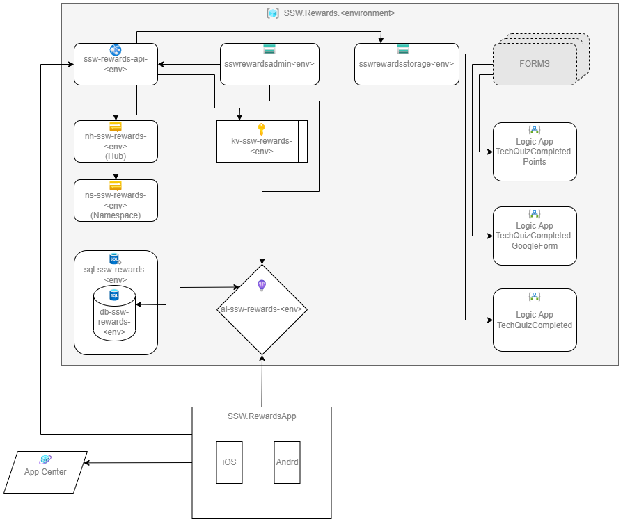
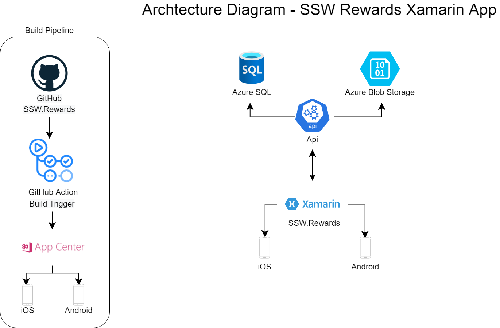
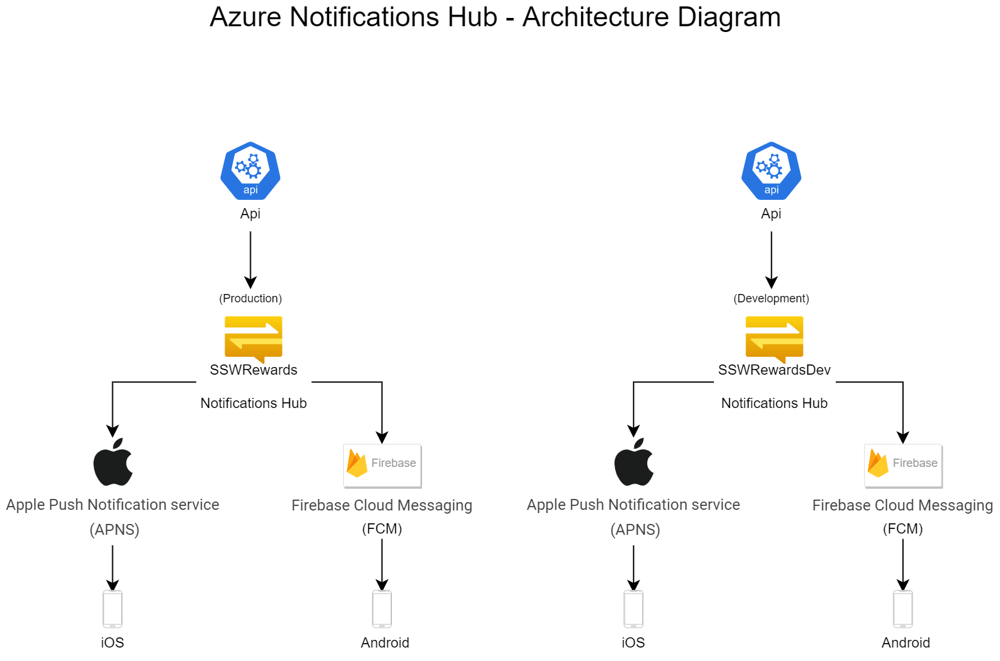
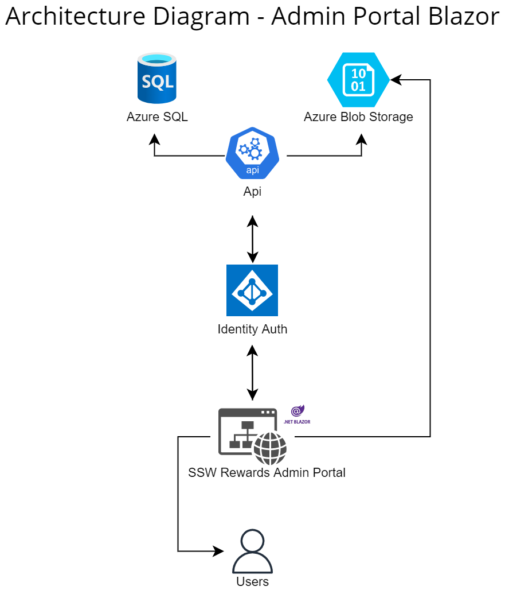
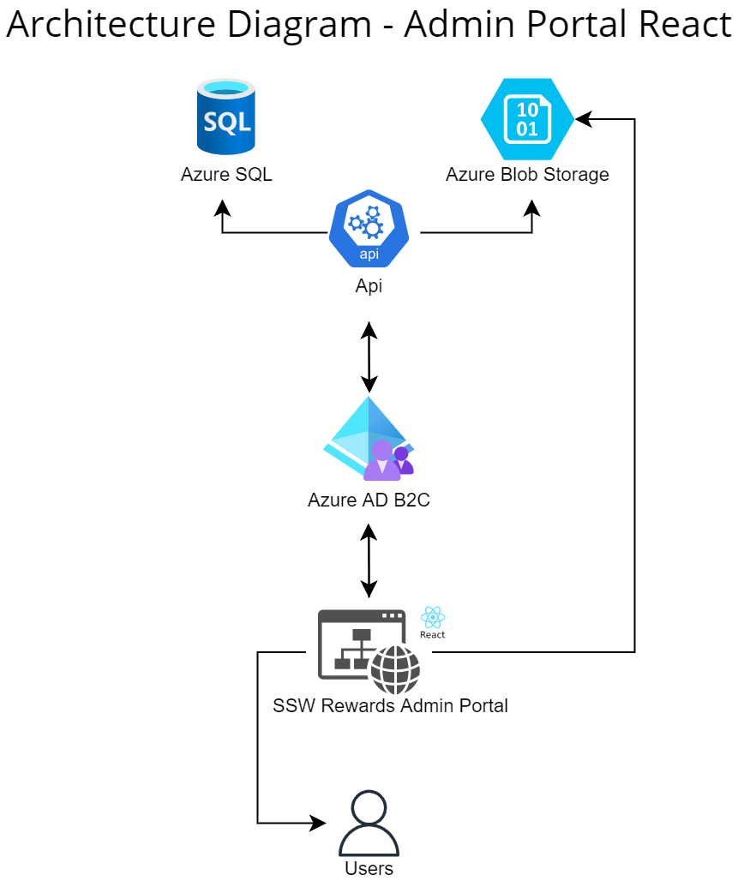

## Technologies & Architecture

**Figure: Architecture diagram of SSW.Rewards project**

| Technology                              | Purpose                                                                  |
| --------------------------------------- | ------------------------------------------------------------------------ |
| Frontend - ~~React~~ Blazor WASM        | Admin Portal to interact with the mobile app                             |
| Auth - ~~Azure AD B2C~~ Identity Server | Auth for logging into the mobile app, accessing the api and Admin portal |
| Database - Azure SQL Server (EF Core)   | Stores User data                                                         |
| Database - Blob storage                 | Stores employee profile pictures                                         |
| Api - .NET CORE 5                       | Backend for the Admin portal and mobile app                              |
| Mobile App - Xamarin Forms              | Cross platform Mobile Application                                        |

### Infrastructure
[Staging](https://portal.azure.com/#@sswcom.onmicrosoft.com/resource/subscriptions/b8b18dcf-d83b-47e2-9886-00c2e983629e/resourceGroups/SSW.Rewards.Staging/overview)
[Production](https://portal.azure.com/#@sswcom.onmicrosoft.com/resource/subscriptions/b8b18dcf-d83b-47e2-9886-00c2e983629e/resourceGroups/SSW.Rewards.Prod/overview)

### Telemetry
[Staging](https://portal.azure.com/#@sswcom.onmicrosoft.com/resource/subscriptions/b8b18dcf-d83b-47e2-9886-00c2e983629e/resourceGroups/SSW.Rewards.Staging/providers/Microsoft.Insights/components/ai-sswrewards-staging/overview)
[Production](https://portal.azure.com/#@sswcom.onmicrosoft.com/resource/subscriptions/b8b18dcf-d83b-47e2-9886-00c2e983629e/resourceGroups/SSW.Rewards.Prod/providers/Microsoft.Insights/components/ai-sswrewards-prod/overview)

### Auth
Auth is excluded from the architecture diagram. If you are working on auth, refer to the [SSW.IdentityServer](https://github.com/SSWConsulting/SSW.IdentityServer) project.

### Architecture Diagrams 

**Figure: Xamarin Architecture Diagram**

**Figure: Azure Notifications Hub Architecture Diagram**

**Figure: Admin Portal Architecture Diagram**

**Figure: Admin Portal (React) Architecture Diagram**