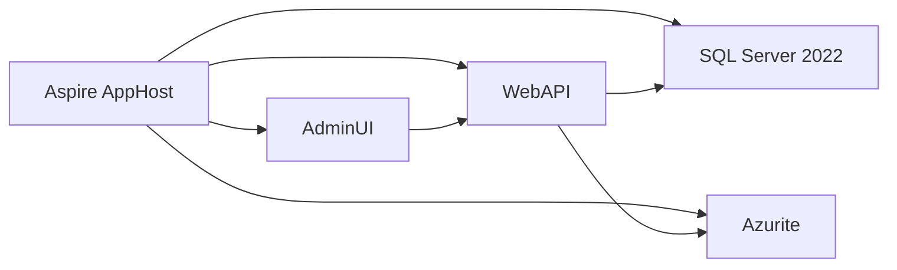
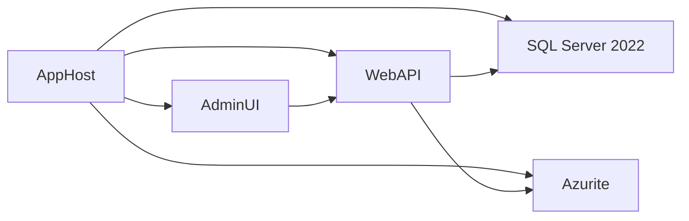

# Aspire 13.2 Integration Plan

> **For agentic workers:** REQUIRED SUB-SKILL: Use superpowers:subagent-driven-development (recommended) or superpowers:executing-plans to implement this plan task-by-task. Steps use checkbox (`- [ ]`) syntax for tracking.

**Goal:** Introduce an Aspire 13.2-based local orchestration model for the SSW Rewards backend stack without changing product behavior, so developers can start WebAPI, AdminUI, SQL Server, and Azurite from one AppHost while the current Docker Compose path remains available during migration.

**Architecture:** Add an Aspire AppHost that becomes the developer entry point for the backend services and local infrastructure. WebAPI and AdminUI stay as the application boundaries; SQL Server and Azurite become explicit resources in the Aspire graph. The migration should be incremental: run AppHost alongside the existing `docker-compose.yml` and `up.ps1` until parity is proven, then shift documentation and launch defaults, then retire the old path only after the team is confident the new one behaves the same.

**Tech Stack:** .NET 10, Aspire 13.2, ASP.NET Core WebAPI, Blazor WASM AdminUI, SQL Server 2022, Azurite, .NET user secrets, existing Docker Compose fallback, PowerShell.

---

## Context

This repo currently starts local dependencies through `docker-compose.yml` and `up.ps1`:

- `up.ps1` checks for a developer HTTPS certificate, writes `.env`, builds containers, starts SQL Server and Azurite, and creates the Hangfire database.
- `docker-compose.yml` runs `rewards-sqlserver`, `rewards-azurite`, `rewards-webapi`, and `rewards-adminui`.
- WebAPI currently carries local configuration for SQL Server, storage, external auth, email, and other secrets through `appsettings.*` plus user secrets.
- AdminUI currently talks to WebAPI over HTTPS on a fixed local port.

The Aspire plan should preserve all of that behavior, but move the orchestration concern into AppHost so the repo stops pretending Docker Compose is the only adult in the room.

## Non-Goals

- Do not implement Aspire in this work.
- Do not change MAUI runtime startup in this work.
- Do not redesign authentication, data access, or API contracts.
- Do not remove Docker Compose until the new path has been verified and documented as the default.

MAUI is intentionally out of scope for the Aspire graph. It stays documented because it still depends on WebAPI and identity-related endpoints, but it should not become part of the AppHost dependency tree. The mobile app has enough to do without being invited to every hosting-model conversation.

## Target State

The intended local topology is:



Notes:

- WebAPI remains the source of truth for business logic and database access.
- AdminUI remains a separate front-end host that consumes WebAPI.
- SQL Server 2022 stays the local relational store.
- Azurite stays the local blob/storage emulator.
- External services such as Identity, QuizGPT, SMTP, and notification infrastructure remain configuration inputs, not Aspire-managed runtime dependencies in this first pass.

## Files Likely To Change During Implementation

These are not being edited now, but they are the expected touch points once the plan is executed:

- Create: `src/AppHost/AppHost.csproj`
- Create: `src/AppHost/Program.cs`
- Create or reuse: `src/ServiceDefaults/ServiceDefaults.csproj`
- Create or reuse: `src/ServiceDefaults/*.cs`
- Modify: `SSW.Rewards.sln`
- Modify: `src/WebAPI/Program.cs`
- Modify: `src/WebAPI/appsettings.Development.json`
- Modify: `src/WebAPI/Properties/launchSettings.json`
- Modify: `src/AdminUI/Program.cs` or startup configuration files used for API wiring
- Modify: `src/AdminUI/Properties/launchSettings.json`
- Modify: `up.ps1`
- Modify: `docker-compose.yml`
- Modify: `_docs/Instructions-Compile.md`
- Modify: `_docs/Managing-DB.md`
- Modify: `_docs/Instructions-Deployment.md`
- Optionally add: `_docs/aspire/*` helper documentation if the implementation needs separate runbooks

## Rollout Phases

### Phase 1: Model the future without changing the default path

Create AppHost and service defaults in parallel with the current setup. The old Docker Compose path remains the default while Aspire is being wired up and verified. This phase is about shape, not replacement.

### Phase 2: Move local orchestration into AppHost

Add WebAPI, AdminUI, SQL Server, and Azurite as Aspire resources. Make sure AppHost can pass the same runtime settings the Docker Compose files currently provide, including HTTPS endpoints, connection strings, and local blob emulator settings.

### Phase 3: Align secrets and launch experience

Move local-only values into a cleaner secrets story so developers do not need to copy half the universe into appsettings files. Update launch profiles and docs so AppHost becomes the preferred F5 path for the backend stack.

### Phase 4: Decommission duplicate startup paths

Once AppHost is stable and verified, simplify `up.ps1`, trim the Docker Compose workflow down to fallback or legacy use only, and remove duplicate instructions from the onboarding docs.

## Task 1: Capture the Current Runtime Contract

**Files:**
- Review: `docker-compose.yml`
- Review: `up.ps1`
- Review: `src/WebAPI/appsettings.json`
- Review: `src/WebAPI/appsettings.Development.json`
- Review: `src/WebAPI/Properties/launchSettings.json`
- Review: `src/AdminUI/Properties/launchSettings.json`
- Review: `_docs/Instructions-Compile.md`
- Review: `_docs/Managing-DB.md`

- [ ] **Step 1: Document the runtime responsibilities that must not change**

```markdown
- WebAPI must still start over HTTPS and serve Swagger locally.
- AdminUI must still be able to call WebAPI from local development.
- SQL Server must remain SQL Server 2022, not Azure SQL Edge.
- Azurite must keep the same storage emulator role for blob-dependent flows.
- Hangfire must still have a dedicated database or equivalent local setup.
```

- [ ] **Step 2: Record the exact current ports and endpoints**

```markdown
- WebAPI: `https://localhost:5001`
- AdminUI: `https://localhost:7137`
- SQL Server: `localhost:1433`
- Azurite: `localhost:10000-10002`
```

- [ ] **Step 3: List the settings that need a migration path**

```markdown
- SQL connection strings
- Azurite connection string
- WebAPI auth and secret values
- email credentials
- signing authority URL
- developer certificate handling
- any bootstrap for the Hangfire database
```

## Task 2: Define the Aspire Solution Shape

**Files:**
- Create: `src/AppHost/AppHost.csproj`
- Create: `src/AppHost/Program.cs`
- Create or reuse: `src/ServiceDefaults/ServiceDefaults.csproj`
- Create or reuse: `src/ServiceDefaults/*.cs`
- Modify: `SSW.Rewards.sln`

- [ ] **Step 1: Add an AppHost project to the solution**

```markdown
- The AppHost should be the single local entry point for orchestration.
- The AppHost should reference WebAPI and AdminUI as projects.
- The solution should make AppHost easy to find without changing the product projects' ownership boundaries.
```

- [ ] **Step 2: Add shared service defaults only if they remove duplication**

```markdown
- Put common OpenTelemetry, resilience, and health wiring in ServiceDefaults if WebAPI and AdminUI both need it.
- Keep the shared layer small; do not move business logic or app-specific configuration there.
```

- [ ] **Step 3: Document the exact resource graph for local development**



- [ ] **Step 4: Note the intended runtime ownership**

```markdown
- AppHost owns orchestration and local service discovery.
- WebAPI owns API behavior and backend integration.
- AdminUI owns the browser-facing admin experience.
- SQL Server and Azurite remain local infrastructure resources.
```

## Task 3: Map WebAPI and AdminUI Into Aspire

**Files:**
- Modify: `src/WebAPI/Program.cs`
- Modify: `src/AdminUI/Program.cs` or the admin startup wiring used for API configuration
- Modify: `src/WebAPI/Properties/launchSettings.json`
- Modify: `src/AdminUI/Properties/launchSettings.json`

- [ ] **Step 1: Plan WebAPI registration in AppHost**

```markdown
- Start WebAPI from AppHost with the same development environment name it already expects.
- Provide the SQL and blob endpoints as resources, not hard-coded localhost strings.
- Keep the HTTPS behavior aligned with the current local certificate approach until the new host model proves stable.
```

- [ ] **Step 2: Plan AdminUI registration in AppHost**

```markdown
- Start AdminUI from AppHost as a separate project resource.
- Wire AdminUI to the WebAPI endpoint returned by Aspire instead of a fixed host name.
- Preserve whatever auth/bootstrap AdminUI currently needs so local login does not regress.
```

- [ ] **Step 3: Identify the runtime values each app should receive**

```markdown
- WebAPI needs SQL Server connection strings, Azurite storage settings, and any secret-backed integrations.
- AdminUI needs the WebAPI base address and whatever identity settings it currently uses.
- Neither project should know whether the local stack is started by Compose, AppHost, or divine intervention.
```

## Task 4: Replace Docker-Only Infrastructure With Aspire Resources

**Files:**
- Modify: `docker-compose.yml`
- Modify: `up.ps1`
- Create or modify: `src/AppHost/Program.cs`
- Modify: `_docs/Managing-DB.md`

- [ ] **Step 1: Model SQL Server as an Aspire resource**

```markdown
- Use the same SQL Server 2022 behavior the repo already depends on.
- Preserve the need for a clean local database and a dedicated Hangfire database.
- Carry forward any restore expectations documented in Managing-DB.md.
```

- [ ] **Step 2: Model Azurite as an Aspire resource**

```markdown
- Configure the local blob emulator so WebAPI can keep using blob-backed features without code changes.
- Verify that the connection string format matches what the current application expects.
```

- [ ] **Step 3: Keep Docker Compose as a temporary fallback**

```markdown
- Leave the Compose file available while AppHost is being validated.
- Do not delete the current compose path until the new path has parity on startup, ports, and local data access.
- Keep the fallback simple; no one needs two complicated ways to start the same database.
```

- [ ] **Step 4: Reduce `up.ps1` to a compatibility shim only after parity**

```markdown
- If the new workflow is stable, `up.ps1` can become a thin wrapper or documentation helper.
- Any required certificate bootstrap should still be documented clearly for developers who are not using Aspire yet.
```

## Task 5: Rework Local Secrets and Configuration Flow

**Files:**
- Modify: `src/WebAPI/appsettings.Development.json`
- Modify: `src/WebAPI/appsettings.json`
- Modify: `src/WebAPI` user-secrets setup if required
- Modify: `src/AdminUI` configuration files if required
- Modify: `_docs/Instructions-Compile.md`

- [ ] **Step 1: Separate infrastructure settings from secrets**

```markdown
- SQL and Azurite endpoints belong in the Aspire orchestration layer.
- Credentials and external service secrets stay in user secrets or other secure local storage.
- The plan should not leave sensitive values in checked-in development JSON.
```

- [ ] **Step 2: Preserve current local secret expectations**

```markdown
- WebAPI still needs its auth, email, and storage-related secrets available locally.
- AdminUI should only receive the settings it actually uses.
- If a setting is not needed at runtime, do not invent a place for it just to feel organized.
```

- [ ] **Step 3: Document how a developer seeds secrets in the new flow**

```markdown
- Explain what remains in user secrets.
- Explain what comes from AppHost resources.
- Explain what still comes from environment variables or local cert bootstrap.
```

## Task 6: Update Rollout Documentation and Developer Workflow

**Files:**
- Modify: `_docs/Instructions-Compile.md`
- Modify: `_docs/Instructions-Deployment.md`
- Modify: `_docs/Managing-DB.md`
- Modify: `_docs/Technologies-and-Architecture.md`
- Optionally modify: `_docs/Definition-of-Ready.md` if onboarding references need to change

- [ ] **Step 1: Add an Aspire-first startup path**

```markdown
- Document the new preferred command for local backend startup once AppHost exists.
- Keep the existing Compose instructions in a fallback section during transition.
```

- [ ] **Step 2: Add a clear migration note for existing developers**

```markdown
- Explain that current Compose-based startup still works until the team fully switches.
- Call out that the database and blob emulator behavior should remain unchanged from the developer's point of view.
```

- [ ] **Step 3: State explicitly why MAUI is not in the Aspire graph**

```markdown
- MAUI remains a separate client application with its own build and device/emulator workflow.
- Its only Aspire-related change in this phase is documentation that points mobile developers to the backend endpoint they should use.
- Do not suggest that mobile debugging now depends on AppHost; that would be a nice way to create confusion at scale.
```

## Task 7: Verification and Acceptance Criteria

**Files:**
- Verify: the future AppHost, WebAPI, AdminUI, and documentation changes

- [ ] **Step 1: Verify the solution builds**

```bash
dotnet build SSW.Rewards.sln
```

Expected:

- the solution builds with AppHost included
- no regressions in WebAPI or AdminUI startup wiring

- [ ] **Step 2: Verify the new local host can start the stack**

```bash
dotnet run --project src/AppHost/AppHost.csproj
```

Expected:

- WebAPI starts under Aspire
- AdminUI starts under Aspire
- SQL Server and Azurite resources are reachable
- the browser endpoints match the documented local development flow

- [ ] **Step 3: Verify the old path still works during rollout**

```bash
docker compose --profile tools up -d
pwsh ./up.ps1
```

Expected:

- legacy startup remains usable until deprecation is explicitly approved
- no change in database access or blob emulator behavior

- [ ] **Step 4: Verify the application still passes existing tests**

```bash
dotnet test
```

Expected:

- no test regressions caused by the new orchestration layer
- any environment-dependent tests are called out explicitly if they require local services

- [ ] **Step 5: Smoke-test the developer workflow**

```markdown
- open Swagger for WebAPI
- open AdminUI in a browser
- confirm both apps can talk to SQL Server
- confirm blob-backed functionality still works against Azurite
- confirm Hangfire bootstrap still succeeds
```

## Risks

- Aspire resource wiring may expose hidden assumptions in the current fixed-port setup, especially where WebAPI and AdminUI are hard-coded to local HTTPS addresses.
- The current `up.ps1` script does more than simple startup, including certificate handling and Hangfire database creation; if that behavior is not replicated or replaced cleanly, local startup will regress.
- Local secrets are currently spread across checked-in development files and developer setup guidance; moving them too aggressively could break onboarding if the new story is not documented with the same level of detail.
- Azurite and SQL Server are both part of the runtime contract, so any mismatch in connection string shape or emulator endpoint behavior will surface immediately in local development.
- MAUI should remain out of the Aspire graph until the backend path is stable; trying to fold it in early would add noise without reducing risk.

## Success Criteria

- AppHost exists and can orchestrate WebAPI, AdminUI, SQL Server, and Azurite locally.
- The new local startup path matches the current repo behavior well enough that developers do not need a separate mental model.
- Docker Compose and `up.ps1` remain available during rollout, then become clearly deprecated only after parity.
- Local secrets are documented in a way that makes the secure path obvious and the insecure path unnecessary.
- MAUI remains documented but not hosted by Aspire.
- The plan is detailed enough that implementation can proceed without inventing new requirements mid-stream.

